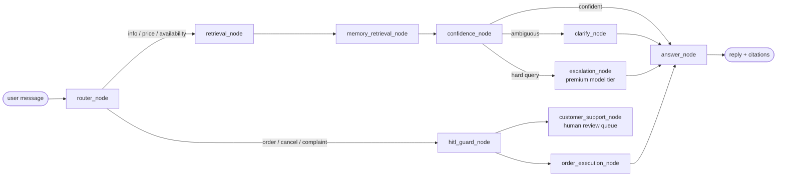

# AI Sales Agent for E-commerce SMEs

[](https://github.com/ThaiG2Pro/ai-agent-sale-v2/actions/workflows/ci.yml)
[](https://github.com/ThaiG2Pro/ai-agent-sale-v2/actions/workflows/nightly-eval.yml)
[](pyproject.toml)
[](LICENSE)

A production-grade **conversational sales agent** for small e-commerce businesses: it ingests a
merchant's product catalog, answers customer questions over **Telegram** with **citation-grounded
RAG**, tracks **buyer intent** (budget, urgency, product interest) across sessions, and pauses for
**human review** before any sensitive action (orders, negotiation, complaints). Built
**Zero-Cost-First**: runs entirely on local models (Ollama / in-process ONNX embeddings) or swaps
to any cloud LLM with one env var — no code change.

**Stack**: Python 3.13 · FastAPI · LangGraph · LiteLLM · PostgreSQL + pgvector · SQLAlchemy 2.0
async · OpenTelemetry → Arize Phoenix · Docker

---

## Engineering highlights

Most chatbot demos stop at "it answers". This project is built and **measured** like a product:

| | |
|---|---|
| 🧪 **782 automated tests** | unit / integration / contract / eval / performance suites; integration tests run the *real* LangGraph against real Postgres |
| 📊 **LLM eval gates with committed baselines** | **Tier-R** (retrieval recall, 34/34 retrieval cases of the ~40-case gold set) runs on every PR with zero LLM cost; **Tier-F** (full agent graph, 12/12 across 3 consecutive runs) runs nightly — a >2pp regression fails the build |
| 🛡️ **CI that blocks bad commits** | lint → unit (real pgvector, mocked LLM) → eval, with a **75% coverage gate** (`--cov-fail-under=75`) |
| 🔍 **Per-node distributed tracing** | every graph node emits an OpenTelemetry span (OpenInference-annotated) into Phoenix — you can see exactly which node was slow in any turn, with a kill-switch and measured overhead |
| 📜 **Decisions written down** | [ADRs](docs/adr/) cover model/provider choice, orchestration, embedding governance — including two real incidents (see below) |
| 🔒 **Privacy by design** | strict per-customer data isolation, PII kept out of logs/spans, and a working **right-to-be-forgotten** cascade delete |

## Architecture

An **async modular monolith** with an agentic core: FastAPI delegates each turn to a LangGraph
`StateGraph` whose state persists in a Postgres checkpointer (conversation continuity across
turns and platforms).


```mermaid
flowchart LR
    START([user message]) --> R[router_node]
    R -->|info / price / availability| RET[retrieval_node]
    R -->|order / cancel / complaint| HG[hitl_guard_node]
    RET --> MEM[memory_retrieval_node]
    MEM --> C[confidence_node]
    C -->|confident| A[answer_node]
    C -->|ambiguous| CL[clarify_node] --> A
    C -->|hard query| E[escalation_node<br/>premium model tier] --> A
    HG --> OE[order_execution_node] --> A
    HG --> CS[customer_support_node<br/>human review queue]
    A --> END([reply + citations])
```

- **RAG with confidence gating** — two thresholds (retrieval-level and fused agent-level) decide
  answer / clarify / escalate / decline, so the bot refuses rather than hallucinates.
- **Model tiering via LiteLLM** — `light / chat / powerful / embed` aliases; backends are pure
  config. The same code runs on Ollama (offline), Groq, Gemini, or OpenAI.
- **Sales intent tracking** — per-customer intent state with optimistic locking, plus append-only
  intent logs extracted every turn.
- **Semantic memory** — vectorized conversation summaries retrieved cross-session, scoped by
  `customer_id`, with model-version governance and STALE-flag migration ([ADR-005](docs/adr/005-memory-hnsw-embedding-governance.md)).
- **HITL** — risk-scored guard (`0.4·(1−confidence) + 0.4·order_value + 0.2·history`) routes
  sensitive actions to a human review queue with timeout escalation and cost guard.

```
api/          FastAPI routes, Telegram webhook, middleware
core/agent/   LangGraph graph, nodes, state, Postgres checkpointer
services/     rag/ (ingest, retrieval, compression), memory/, hitl/, ai.py (LiteLLM gateway)
models/       SQLAlchemy 2.0 async schema (UUIDv7, pgvector)   migrations/  Alembic
tests/        unit / integration / contract / eval / performance (782 tests)
```

## How the evals work

LLM apps regress silently — a prompt tweak or model swap can break retrieval while every unit
test stays green. The eval gate (`scripts/eval_gate.py`, ~40-case Vietnamese gold set) closes
that hole:

- **Tier-R (retrieval)** — recall against gold chunks using in-process fastembed embeddings.
  Needs no LLM key, so it runs on **every PR**.
- **Tier-F (full graph)** — runs gold queries through the *production* agent graph (including
  multi-intent decomposition) and grades answers by deterministic rules. Runs **nightly** against
  a committed baseline; pass-rate drops >2pp fail the workflow.

Baselines live in `tests/eval/baselines/` and are re-committed deliberately whenever behavior
changes on purpose — an audit trail for answer quality.

## Two incidents worth reading about

Both are documented in [ADR-006](docs/adr/006-model-provider-and-embedding-runtime.md):

1. **The embedding library changed the vector space without changing the model name.** fastembed
   switched `multilingual-e5-large` pooling (CLS → mean) between minor releases — every stored
   vector silently became incompatible, and DB-level model-name filters can't catch it. Fix:
   exact-pin the library, treat any embedding change as a **migration event** with a 7-step
   runbook (re-embed, STALE-flag memory, re-baseline evals).
2. **Ollama silently truncates RAG prompts.** Its default context (~2–4k tokens) drops the
   retrieved chunks without any error — retrieval succeeds, the model just never sees the
   evidence. Fix: explicit `num_ctx` injected at the LiteLLM gateway choke point, enforced by a
   unit test.

## Second graph: a support assistant for another product (Spacely)

The same engine also powers the customer-support chat of
[Spacely](https://github.com/ThaiG2Pro/elearning-platform), a learning platform — without
touching the sales graph. Instead of a persona switch inside the order/HITL state machine
(tried first, rejected: every shop change could break support), `core/support/` compiles a
**second `StateGraph`** that reuses the domain-neutral nodes and adds three of its own:

```
support_router_node (4 intents) ─┬→ support_answer_node (smalltalk)
                                 └→ retrieval_node → memory_retrieval_node → confidence_node
                                                                              ├→ support_clarify_node → support_answer_node
                                                                              └→ support_answer_node (RAG + groundedness check)
```

- Exposed at `POST /support/query` behind `SUPPORT_GRAPH_ENABLED` (default off) and an optional
  `X-Agent-Key`; Spacely's Next.js route proxies to it (rate limits + identity live there).
- Knowledge base = Spacely's FAQ / guide / about pages, pulled from its own
  `GET /api/v1/support/knowledge` by `scripts/ingest_spacely_faq.py` into `products` rows on a
  **separate database** (`scripts/run_spacely_local.sh`), so the shop catalog never mixes in.
- No order placement, negotiation, cancellation or HITL pause: those intents fold into
  advisory ones; complaints always get an apology + human handoff, never a refund promise.
- Own eval gate: `scripts/eval_support.py` over `tests/eval/support_gold.json` — Tier-R 19/19,
  Tier-F 25/25 committed as baselines.

Plan and decisions: [docs/upgrade-plan-support-graph.md](docs/upgrade-plan-support-graph.md).

## Quickstart

```bash
# 1. Install uv, then:
uv sync
cp .env.example .env          # set TELEGRAM_* vars + GROQ_API_KEY (default profile: Groq chat, local embeddings)
echo "change-me" > secrets/db_password.txt   # Postgres + the api container read this Docker secret
echo "DB_PASSWORD=change-me" >> .env         # host-run commands (alembic, scripts) use the env var

# 2. Infra (Postgres+pgvector, Phoenix tracing UI, and the API on :8000 via host networking)
docker compose up -d --build

# 3. Migrations + demo catalog
uv run alembic upgrade head
uv run python scripts/demo_seed.py

# 4. Ask a question
curl -X POST localhost:8000/query -H 'Content-Type: application/json' \
  -d '{"query": "Điện thoại nào pin tốt dưới 10 triệu?"}'
```

Traces appear at `http://localhost:6006` (Phoenix). Telegram setup: [docs/telegram-setup.md](docs/telegram-setup.md) ·
full deployment guide: [docs/deployment.md](docs/deployment.md) · scripted demo scenarios:
[docs/demo-runbook.md](docs/demo-runbook.md).

**Model config** (any LiteLLM string works):

```bash
# Cloud chat + local embeddings (the .env.example default, no GPU needed)
CHAT_MODEL=groq/openai/gpt-oss-120b
EMBED_MODEL=local/multilingual-e5-large    # fastembed ONNX, in-process

# ...or fully offline via Ollama — Profile 1 in .env.example
# (see ADR-006 for the mandatory num_ctx setting; always pin the exact quant tag)
CHAT_MODEL=ollama/qwen3-4b-q6:latest
```

## Development

```bash
./scripts/lint.sh check            # ruff check + format check + lock verify
uv run pytest                      # unit suite (mocked LLM, needs Postgres)
uv run pytest -m integration       # full-graph tests (needs a chat LLM)
./scripts/eval_gate.sh --tier r    # retrieval eval gate
```

CI (`.github/workflows/ci.yml`) runs lint → unit+coverage → Tier-R eval on every push/PR; Tier-F
runs nightly (`nightly-eval.yml`, needs `GROQ_API_KEY` secret). Branch protection setup for
repo owners is documented in [docs/deployment.md](docs/deployment.md).

## How this was built (and how AI was used)

Solo project, Feb → Oct 2026, 196 commits. **70 of them are co-authored with Claude** and that
is on purpose, not hidden:

- **Spec-driven workflow.** Every change goes proposal → spec deltas → design → tasks → build →
  QA report, with a human gate between phases. The artifacts are committed under `openspec/`
  (see `openspec/changes/archive/*/` for a full S1→S6 trail including the QA report and retro).
- **What the AI did:** drafting code against an approved design, writing the first pass of tests,
  bulk refactors, research digests (`docs/wayfinder/research/`).
- **What I did:** every architectural decision in `docs/adr/`, the eval gold set and what "pass"
  means, the HITL risk formula and its invariants, root-causing the two incidents in ADR-006,
  and rejecting the regex "fixes" that made tests pass but made the agent dumber
  (`reports/2026-08-22-architecture-analysis.md`).
- **What went wrong:** AI-drafted docs drifted from code over time; a 2026-10-02 review found and
  fixed 5 groups of stale claims (see `CHANGELOG.md`). Docs now get reviewed like code.

## Documentation map

| | |
|---|---|
| [docs/adr/](docs/adr/) | Architecture Decision Records (tech selection, LangGraph orchestration, Telegram library, embedding governance, model providers) |
| [docs/observability.md](docs/observability.md) | OTel → Phoenix setup, per-node span design |
| [docs/deployment.md](docs/deployment.md) | Docker deployment, provider options, ops notes |
| [docs/demo-runbook.md](docs/demo-runbook.md) | 5 scripted demo scenarios with seed data |
| [docs/feature-scorecard.md](docs/feature-scorecard.md) | honest self-assessment, re-scored after each upgrade plan (last: 2026-10-02) |
| [docs/upgrade-plan-support-graph.md](docs/upgrade-plan-support-graph.md) | the Spacely support graph: why a second graph, node contracts, eval results |

---

*Portfolio project — built solo to production standards (spec-driven SDLC, eval-gated releases).
Not affiliated with any merchant; the demo catalog is synthetic.*
