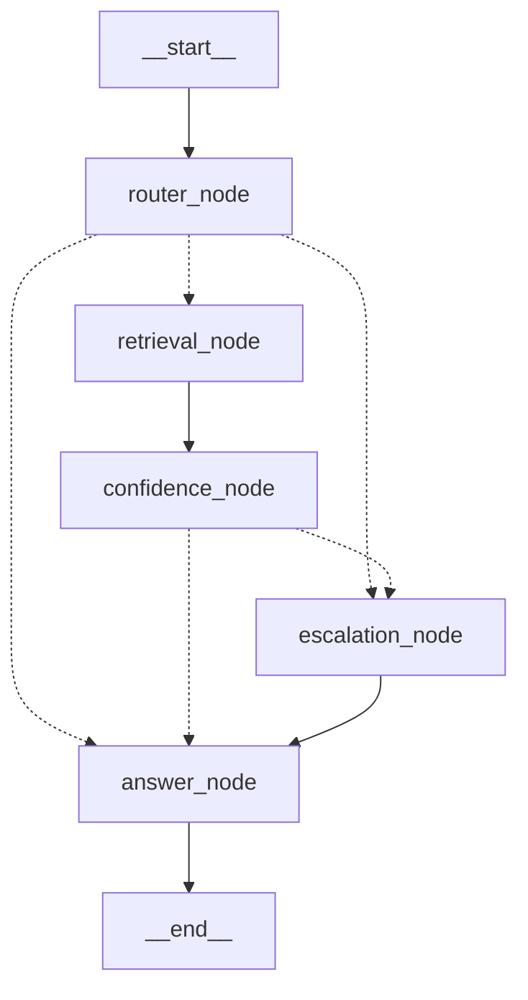

# Week 3 — Developer Knowledge Base
> **Audience:** New developers joining to debug, refactor, or extend the Week 3 agentic system.  
> **Purpose:** Architecture trace, node logic, routing decisions, state contracts, test map.  
> **Prerequisite:** Read [week2.md](../week2/week2.md) first — Week 3 extends, not replaces, Week 2.

---

## Table of Contents
1. [What Week 3 adds](#1-what-week-3-adds)
2. [Repository layout (new files)](#2-repository-layout-new-files)
3. [Agent state contract](#3-agent-state-contract)
4. [LangGraph graph topology](#4-langgraph-graph-topology)
5. [Node implementations](#5-node-implementations)
   - 5.1 [router\_node](#51-router_node)
   - 5.2 [retrieval\_node](#52-retrieval_node)
   - 5.3 [confidence\_node](#53-confidence_node)
   - 5.4 [escalation\_node](#54-escalation_node)
   - 5.5 [answer\_node](#55-answer_node)
6. [Tool registry](#6-tool-registry)
7. [RAG pipeline changes (Week 2 → Week 3)](#7-rag-pipeline-changes-week-2--week-3)
8. [Confidence scoring and guard logic](#8-confidence-scoring-and-guard-logic)
9. [Model escalation logic](#9-model-escalation-logic)
10. [API layer (new agent endpoints)](#10-api-layer-new-agent-endpoints)
11. [CLI (agent)](#11-cli-agent)
12. [Observability wiring](#12-observability-wiring)
13. [Configuration (Week 3 additions)](#13-configuration-week-3-additions)
14. [Migrations](#14-migrations)
15. [Testing](#15-testing)
16. [Setup from scratch](#16-setup-from-scratch)
17. [Common debug traces](#17-common-debug-traces)
18. [Critical gotchas](#18-critical-gotchas)

---

## 1. What Week 3 adds

Week 2 delivered a linear RAG pipeline: one path, no branching, one model.

Week 3 wraps that pipeline in a **LangGraph state machine** that makes intelligent routing decisions at runtime:

| Concern | Week 2 | Week 3 |
|---------|--------|--------|
| Architecture | Linear pipeline | LangGraph StateGraph (5 nodes) |
| Intent awareness | None | 7-class classifier (router_node) |
| Model selection | Fixed (economy-chat) | Adaptive: economy → premium escalation |
| Confidence guard | Single threshold in pipeline | Two-layer guard: Layer 1 (RAG) + Layer 2 (fused) |
| Streaming | None | Per-node SSE events (`astream_events` v2) |
| API surface | `POST /query` only | + `POST /agent/query`, `POST /agent/stream` |
| CLI | `rag_admin.py` (admin) | + `run_agent.py` (debug agent) |
| Tests | Unit + integration for RAG | + Agent flow, contract, escalation, confidence node tests |

**What is NOT changed in Week 3:**
- The `services/rag/` pipeline logic (Week 2) — only `search_and_retrieve()` is called now instead of `answer_with_rag()`
- The database schema (no new migrations in Week 3)
- The `POST /query` Week 2 endpoint (still live alongside new agent endpoints)
- Semantic cache logic (`services/semantic_cache.py`)

---

## 2. Repository layout (new files)

Only the delta from Week 2:

```
ai-agent-sale-v2/
├── core/
│   └── agent/                          # ← NEW in Week 3
│       ├── __init__.py
│       ├── state.py                    # TypedDict AgentState + Pydantic boundary models
│       ├── graph.py                    # build_graph(), astream_agent(), get_mermaid_diagram()
│       ├── tools.py                    # make_retrieval_tool(), make_rag_tool(), inventory_lookup
│       └── nodes/
│           ├── __init__.py
│           ├── router.py               # router_node + _get_next_node() + _route_after_router()
│           ├── retrieval.py            # retrieval_node (calls make_retrieval_tool factory)
│           ├── confidence.py           # confidence_node + _route_after_confidence()
│           ├── escalation.py           # escalation_node (pure Python, zero LLM)
│           └── answer.py               # answer_node (LLM gen + cache write + model_trace write)
├── api/
│   └── routes/
│       └── agent.py                    # ← NEW: POST /agent/query, POST /agent/stream
├── cli/
│   └── run_agent.py                    # ← NEW: debug CLI for agent (--stream, --api flags)
├── services/
│   └── rag/
│       └── pipeline.py                 # ← MODIFIED: search_and_retrieve() + RetrievalResult added
├── tests/
│   ├── unit/
│   │   ├── test_agent_state.py         # ← NEW: AgentState, IntentEnum, EscalationReasonEnum
│   │   ├── test_router_node.py         # ← NEW: routing map, intent classification
│   │   ├── test_confidence_node.py     # ← NEW: Layer 1/2 guard paths, fused score
│   │   ├── test_escalation_node.py     # ← NEW: escalation decisions, fallback
│   │   └── test_answer_node.py         # ← NEW: cache hit, declined, accepted paths
│   ├── integration/
│   │   └── test_agent_flow.py          # ← NEW: full graph execution paths
│   └── contract/
│       └── tools/
│           ├── conftest.py
│           ├── test_rag_tool_contract.py       # ← NEW: RAGSearchInput/Output contract
│           └── test_inventory_tool_contract.py # ← NEW: InventoryLookup contract
├── docs/
│   └── week3/
│       ├── agent-graph.mmd             # ← NEW: Mermaid diagram (generated by graph.py)
│       ├── tier2-eval.md               # ← NEW: Tier 2 manual eval (COMPLAINT/NEGOTIATION)
│       ├── techniques-overview.md      # ← NEW: Week 3 technical synthesis
│       └── techniques-reference.md     # ← NEW: Week 3 keyword reference (no code)
├── docs/adr/
│   └── 002-langgraph-orchestration.md  # ← NEW: ADR for LangGraph decision
```

**Files from Week 2 that were modified:**
- `services/rag/pipeline.py` — added `RetrievalResult` model and `search_and_retrieve()` function
- `api/main.py` — registered `agent` router; added model warmup in lifespan
- `core/config.py` — added `LAYER1_CONFIDENCE_THRESHOLD`, `AGENT_CONFIDENCE_THRESHOLD`, `AGENT_ALPHA`, `PREMIUM_MODEL`, `RERANKER_ENABLED`
- `core/logging.py` — integrated OpenTelemetry, LangChain/LangGraph instrumentor, logfire

---

## 3. Agent state contract

**File:** `core/agent/state.py`

The `AgentState` TypedDict is the **single source of truth** for all data flowing through the graph. Every node reads from it and returns a partial `dict` that LangGraph merges back.

```python
class AgentState(TypedDict):
    # ── Input ──────────────────────────────────────────────────────────────
    session_id: str                    # Conversation thread ID
    user_message: str                  # Original user query
    messages: Annotated[list, add_messages]  # Conversation history (deduped by ID)

    # ── Intent classification (set by router_node) ──────────────────────
    intent: str | None                 # Primary intent string (e.g. "PRICING")
    secondary_intents: list[str]       # All detected intents besides primary
    intent_confidence: float           # Classifier confidence 0.0–1.0

    # ── Retrieval (set by retrieval_node) ───────────────────────────────
    retrieved_chunks: list[dict]       # [{product_id, chunk_id, text}]
    citations: Annotated[list, operator.add]  # Citation Pydantic objects (accumulated)
    similarity_score: float            # Best cosine similarity from vector search
    rerank_score: float | None         # Reranker score if RERANKER_ENABLED
    cached_answer: str | None          # Pre-generated answer from cache hit → skip LLM
    canonical_query: str | None        # Normalized query → for L1 hash write
    query_vector: list | None          # Embedded vector → for L2 cache write

    # ── Confidence guard (set by confidence_node) ───────────────────────
    confidence_score: float            # Fused score: (1-α)*similarity + α*rerank
    declined: bool                     # True if any guard fired (Layer 1 OR Layer 2)

    # ── Escalation (set by escalation_node) ─────────────────────────────
    model_used: str | None             # Final selected model alias (e.g. "economy-chat")
    escalation_flag: bool              # True if escalated to premium
    escalation_reason: EscalationReasonEnum | None
    escalation_failure: bool           # True if premium unavailable, fell back

    # ── Answer (set by answer_node) ─────────────────────────────────────
    response: str | None               # Final answer text

    # ── Error ─────────────────────────────────────────────────────────────
    error: str | None                  # Non-fatal error message
```

### Reducers

| Field | Reducer | Behavior |
|-------|---------|----------|
| `messages` | `add_messages` | Accumulates, deduplicates by message ID |
| `citations` | `operator.add` | Accumulates across nodes (never drops) |
| Everything else | Default (replace) | Last writer wins |

### Pydantic boundary models

These are NOT state fields — they are **I/O contracts** between nodes and external systems:

| Model | Purpose | Used by |
|-------|---------|---------|
| `IntentClassification` | LLM output from router_node | `router_node` |
| `EscalationDecision` | Escalation decision record | `escalation_node` |
| `Citation` | Single cited source | `retrieval_node`, `answer_node` |
| `TraceMetadata` | JSONB payload for model_trace | `answer_node` |
| `NodeStreamEvent` | Per-node SSE event | `astream_agent()` |

### Enums

```python
class IntentEnum(StrEnum):
    INFO_QUERY, PRICING, COMPARISON, COMPLAINT, NEGOTIATION, SMALLTALK, AVAILABILITY

class EscalationReasonEnum(StrEnum):
    INTENT_ESCALATION = "intent_escalation"  # COMPLAINT or NEGOTIATION intent
    LOW_CONFIDENCE    = "low_confidence"      # Borderline INFO_QUERY score
    NONE              = "none"
```

### `make_initial_state()` factory

**Always use this** — never construct `AgentState` dict manually.
All boolean flags MUST be explicitly `False` (not `None`) at init time:

```python
state = make_initial_state(user_message="Giá MacBook?", session_id="abc-123")
# Returns all 19 fields with safe defaults
```

---

## 4. LangGraph graph topology

**File:** `core/agent/graph.py`

### Graph Mermaid Diagram



Dashed arrows `-.->` = conditional edges; solid `-->` = fixed edges.

### Execution paths by intent

| Intent | Path |
|--------|------|
| `INFO_QUERY` (sim ≥ 0.7) | router → retrieval → confidence → answer |
| `INFO_QUERY` (0.45 ≤ sim < 0.7) | router → retrieval → confidence → **escalation** → answer |
| `PRICING`, `AVAILABILITY` (any sim) | router → retrieval → confidence → answer |
| `COMPARISON` (sim < 0.7) | router → retrieval → confidence → answer (declined) |
| `COMPLAINT` / `NEGOTIATION` | router → **escalation** → answer |
| `SMALLTALK` | router → **answer** (no retrieval) |
| sim < 0.45 (Layer 1) | router → retrieval → confidence → answer (declined) |

### Key functions

```python
# Build + compile graph — call once per request or cache per session
graph = build_graph(checkpointer=None)

# Stream per-node events (SSE)
async for event in astream_agent(message, session_id, db=db):
    yield event  # NodeStreamEvent

# Export Mermaid diagram to file
export_mermaid_to_file("docs/week3/agent-graph.mmd")
```

### DB injection pattern

The `db` (AsyncSession) is passed via LangGraph's `configurable` dictionary:
```python
config = {"configurable": {"thread_id": session_id, "db": db}}
await graph.ainvoke(initial_state, config=config)
```

Nodes access it as:
```python
db = (config.get("configurable") or {}).get("db")
```

This is required because nodes are plain `async def` functions — they cannot receive `db` as a constructor argument.

---

## 5. Node implementations

### 5.1 `router_node`

**File:** `core/agent/nodes/router.py`

**Role:** First node. Classifies user intent using the economy-chat LLM and routes to the correct next node using `Command(goto=...)`.

**LLM call:** Yes — economy-chat with `response_format=IntentClassification`.

**Routing logic (`_get_next_node()`):**
```
COMPLAINT or NEGOTIATION (primary OR secondary) → escalation_node
SMALLTALK (primary) → answer_node (skip retrieval, save cost)
INFO_QUERY / PRICING / COMPARISON / AVAILABILITY → retrieval_node
```

**State update returned:**
```python
{
    "intent": "PRICING",               # str, not enum
    "secondary_intents": [],           # list[str]
    "intent_confidence": 0.95,
}
```

**Multi-intent rule (FR-007):** `IntentClassification.has_escalation_intent()` checks BOTH primary AND secondary intents. If a user query is `INFO_QUERY` + `COMPLAINT`, escalation wins.

**Two routing mechanisms coexist:**
- `Command(goto=...)` — actual runtime routing
- `_route_after_router(state)` + `add_conditional_edges()` — for Mermaid diagram rendering only

---

### 5.2 `retrieval_node`

**File:** `core/agent/nodes/retrieval.py`

**Role:** Calls the retrieval tool (wrapping Week 2 `search_and_retrieve()`) to find product chunks and check cache. **Does not call LLM for answer generation.**

**LLM calls:** No — only embedding model (via `search_and_retrieve`).

**Tool used:** `make_retrieval_tool(db)` factory closure from `core/agent/tools.py`

**Why a tool factory?** DB session cannot be serialized by LangGraph checkpointer. Using a factory closure avoids passing `db` as a state field.

**State update returned:**
```python
{
    "retrieved_chunks": [...],         # [{product_id, chunk_id, text}]
    "citations": [Citation(...)],      # Pydantic objects
    "similarity_score": 0.72,
    "declined": False,                 # True only if Layer 1 fired (sim < 0.45)
    "cached_answer": None,             # Set if L1/L2 cache hit
    "canonical_query": "normalized q", # For L1 hash write
    "query_vector": [0.1, ...],        # For L2 cache write
}
```

**Intent injection optimization:** `intent` from state is passed to `search_and_retrieve(intent=...)` to skip the `normalize_query()` LLM call (~1-2s savings per request):
```python
result = await retrieve.ainvoke({
    "query": state["user_message"],
    "intent": state.get("intent"),   # pre-classified by router_node
})
```

---

### 5.3 `confidence_node`

**File:** `core/agent/nodes/confidence.py`

**Role:** Computes fused confidence score, applies Layer 2 guard, and routes accordingly. **Pure Python — zero LLM call.**

**Fusion formula:**
```
confidence_score = (1 - α) × similarity_score + α × rerank_score
```
Default: `α = 0.7` (`AGENT_ALPHA`). If no reranker: `confidence_score = similarity_score`.

**Three execution paths:**

| Path | Condition | Action |
|------|-----------|--------|
| Layer 1 fast-path | `state["declined"] == True` | Return immediately with `declined=True` (skip fusion) |
| INFO_QUERY borderline | `0.45 ≤ sim < 0.7` AND `intent in {INFO_QUERY, PRICING, AVAILABILITY}` | Set `declined=False`, route to escalation_node |
| Normal | All other cases | Compute fused score; if fused < 0.70 → `declined=True` |

**Routing function `_route_after_confidence(state)`:**
```
intent ∈ {INFO_QUERY, PRICING, AVAILABILITY} AND sim < 0.70 AND not Layer1_declined
    → escalation_node
otherwise
    → answer_node
```

**State update returned:**
```python
{"confidence_score": 0.68, "declined": False}
```

---

### 5.4 `escalation_node`

**File:** `core/agent/nodes/escalation.py`

**Role:** Decides which model to use. **Pure Python — zero LLM call.**

**Decision matrix:**

| Trigger | Model selected | `escalation_flag` | `reason` |
|---------|---------------|-------------------|---------|
| `COMPLAINT` or `NEGOTIATION` in any intent | `settings.PREMIUM_MODEL` | `True` | `intent_escalation` |
| `INFO_QUERY` borderline (routed from confidence_node) | `settings.PREMIUM_MODEL` | `True` | `low_confidence` |
| `PRICING` / `AVAILABILITY` borderline | `economy-chat` | `False` | `none` |
| No escalation condition | `None` (answer_node defaults) | `False` | `none` |

**Graceful fallback (T064):** If `PREMIUM_MODEL` is not configured or unavailable → falls back to `economy-chat` and sets `escalation_failure=True`.

**State update returned:**
```python
{
    "escalation_flag": True,
    "escalation_reason": EscalationReasonEnum.INTENT_ESCALATION,
    "model_used": "premium-chat",       # or "economy-chat" on fallback
    "escalation_failure": False,
}
```

---

### 5.5 `answer_node`

**File:** `core/agent/nodes/answer.py`

**Role:** Universal terminal node. All graph paths converge here. Generates response (or returns fallback), writes cache, writes `model_trace`.

**Three execution paths:**

| Path | Condition | LLM call? | Cache write? |
|------|-----------|-----------|-------------|
| **Cache hit** | `state["cached_answer"]` is set | ❌ No | ❌ No (already cached) |
| **Declined** | `state["declined"] == True` | ❌ No | ❌ No |
| **Accepted** | All other states | ✅ Yes | ✅ Yes |

**Model selection:** Uses `state["model_used"]` set by escalation_node. Falls back to `"economy-chat"` if `None`.

**System prompt (Vietnamese):**
```
"Bạn là trợ lý bán hàng AI chuyên nghiệp. Trả lời bằng tiếng Việt, thân thiện và hữu ích.
Chỉ dùng thông tin từ context được cung cấp. Nếu không có thông tin phù hợp, nói rõ điều đó."
```

**Decline message:** Defined in `services/rag/constants.py` as `DECLINE_MESSAGE`.

**`model_trace` write (FR-008):** Called on ALL paths (cache hit, declined, accepted) with a `TraceMetadata` JSONB payload:
```python
metadata_ = {
    "guard_decision": "ACCEPTED",      # or "REJECTED", "CACHE_HIT"
    "escalation_reason": ...,
    "escalation_failure": ...,
    "escalation_flag": ...,
    "declined": ...,
    "intended_model": ...,
}
```
On write failure: logs to `stderr` and does NOT raise (fail-safe).

**State update returned:**
```python
{"response": "MacBook Pro M3 có giá 54.990.000 VND.", "model_used": "economy-chat"}
```

---

## 6. Tool registry

**File:** `core/agent/tools.py`

Week 3 introduces a typed tool registry wrapping Week 2 RAG components and providing an inventory lookup stub.

### `make_retrieval_tool(db)` — primary tool

```python
# Used by retrieval_node — NO LLM generation
retrieve = make_retrieval_tool(db)
result: RetrievalResult = await retrieve.ainvoke({"query": "...", "intent": "PRICING"})
```

Returns a `RetrievalResult` with:
- `chunks`, `citations`, `best_similarity` — from vector+FTS search
- `declined` — Layer 1 guard result
- `cached_answer`, `canonical_query`, `query_vector` — cache state

### `make_rag_tool(db)` — legacy tool (not used by agent graph)

```python
# Used only for Week 2 /query endpoint compatibility
rag_search = make_rag_tool(db)
result: RAGSearchOutput = await rag_search.ainvoke(input)
```

Full pipeline including LLM answer generation. NOT used by agent graph (answer_node handles generation separately).

### `inventory_lookup` — stub (Week 6)

```python
result: InventoryLookupOutput = await inventory_lookup.ainvoke({"sku": "LAPTOP-001"})
# Always returns stock_level=99, available=True
# Real ERP integration deferred to Week 6
```

### Tool input/output schemas

| Schema | Fields | Validation |
|--------|--------|-----------|
| `RAGSearchInput` | `query` (1-2000 chars), `session_id` (UUID regex), `model` | Strict Pydantic |
| `RAGSearchOutput` | `answer`, `declined`, `citations[]`, `similarity_score`, `confidence_score`, `model_used`, `chunks_used` | Strict Pydantic |
| `RetrievalInput` | `query` (1-2000 chars), `intent: str | None` | Non-strict (intent=None allowed) |
| `InventoryLookupInput` | `sku` (uppercase regex), `warehouse_id?` | Strict Pydantic |
| `InventoryLookupOutput` | `sku`, `stock_level`, `available`, `error?` | Strict Pydantic |

**Schema drift detection:** `tests/contract/tools/` contains baseline JSON snapshots. If any tool schema field is renamed or removed, the contract test fails immediately.

---

## 7. RAG pipeline changes (Week 2 → Week 3)

**File:** `services/rag/pipeline.py`

### New: `RetrievalResult` model

```python
class RetrievalResult(BaseModel):
    cached_answer: str | None          # None if no cache hit
    cached_citations: list[dict]       # Empty if no cache hit
    declined: bool                     # True if Layer 1 fired (sim < 0.45)
    citations: list[dict]              # [{product_id, chunk_id, sku, name, source_text}]
    chunks: list[dict]                 # Compressed chunks for answer_node
    best_similarity: float
    similarity_gap: float              # gap between top-1 and top-2
    canonical_query: str               # For L1 hash write
    query_vector: list[float]          # For L2 cache write
    query_category: str                # "short" | "long" | "ambiguous"
    top_k_used: int
```

### New: `search_and_retrieve()` function

```python
async def search_and_retrieve(
    db,
    query: str,
    intent: str | None = None          # Pre-classified from router_node
) -> RetrievalResult:
```

**Difference from `answer_with_rag()`:** Steps 1-11 only — no LLM generation. Stops after compression and returns `RetrievalResult`.

**Intent injection:** When `intent` is provided (pre-classified by router_node), `normalize_query()` is **skipped**. Instead, a simple string normalization is used. Saves ~1-2s per request.

| Step | `answer_with_rag()` | `search_and_retrieve()` |
|------|---------------------|------------------------|
| Intent classification + normalize | ✅ LLM call | ⚡ Skipped if `intent` provided |
| Cache check (L1/L2) | ✅ | ✅ |
| Embed query | ✅ | ✅ |
| Vector + FTS search | ✅ | ✅ |
| RRF ranking | ✅ | ✅ |
| Compression | ✅ | ✅ |
| Layer 1 guard | ✅ | ✅ (returns `declined=True`) |
| LLM answer generation | ✅ | ❌ (handled by answer_node) |
| Cache write | ✅ | ❌ (handled by answer_node) |
| model_trace write | ✅ | ❌ (handled by answer_node) |

Both functions coexist — `answer_with_rag()` is still used by `POST /query` (Week 2 endpoint).

---

## 8. Confidence scoring and guard logic

Two independent guards. Either can decline a query.

### Layer 1 — RAG Layer (inside `search_and_retrieve`)

```
threshold = settings.LAYER1_CONFIDENCE_THRESHOLD  # default: 0.45
if best_similarity < 0.45 → RetrievalResult(declined=True)
```

This fires in `retrieval_node` and propagates `declined=True` to `confidence_node`.

### Layer 2 — Fused Score (inside `confidence_node`)

```
fused = (1 - AGENT_ALPHA) × similarity + AGENT_ALPHA × rerank
threshold = settings.AGENT_CONFIDENCE_THRESHOLD  # default: 0.70
if fused < 0.70 → declined=True
```

**Exception — borderline intents:** For `INFO_QUERY`, `PRICING`, and `AVAILABILITY`, Layer 2 does NOT set `declined=True` when `0.45 ≤ sim < 0.70`. Instead, the query is routed to `escalation_node` to try with the premium model.

### Threshold constants

| Constant | Location | Default | Meaning |
|----------|----------|---------|---------|
| `LAYER1_CONFIDENCE_THRESHOLD` | `core/config.py` | `0.45` | Raw similarity below this → instant decline |
| `AGENT_CONFIDENCE_THRESHOLD` | `core/config.py` | `0.70` | Fused score below this → Layer 2 decline |
| `AGENT_ALPHA` | `core/config.py` | `0.7` | Reranker weight in fusion formula |

**Invariant:** `LAYER1_CONFIDENCE_THRESHOLD` ≤ `AGENT_CONFIDENCE_THRESHOLD`. If you change these, keep this invariant.

---

## 9. Model escalation logic

### Model tiers

| Alias | Config variable | Default model | Usage |
|-------|----------------|--------------|-------|
| `light-chat` | `LIGHT_CHAT_MODEL` | `ollama/qwen3:0.6b` | Keyword extraction (ingest only) |
| `economy-chat` | `CHAT_MODEL` | `ollama/qwen3-1.7b` | Intent classification + standard answers |
| `economy-embedding` | `EMBED_MODEL` | `ollama/bge-m3` | Embeddings |
| `premium-local-chat` | `POWERFUL_CHAT_MODEL` | `ollama/deepseel-r1:1.5b` | Local premium (dev) |
| `premium-chat` | `PREMIUM_MODEL` | `premium-chat` (→ Groq llama-3.1-70b) | Cloud premium |

### Escalation decision tree

```
escalation_node receives state with intent and similarity_score:

if intent in {COMPLAINT, NEGOTIATION} (primary OR secondary):
    → model = PREMIUM_MODEL, reason = intent_escalation

elif intent == INFO_QUERY (borderline, routed from confidence_node):
    → model = PREMIUM_MODEL, reason = low_confidence

elif intent in {PRICING, AVAILABILITY} (borderline):
    → model = economy-chat, reason = none (answer with retrieved chunks)

else:
    → model = None (answer_node defaults to economy-chat)
```

### Graceful fallback

If `PREMIUM_MODEL` is empty or unavailable:
```python
selected_model = "economy-chat"
escalation_failure = True  # logged in model_trace
```

### Environment-specific model aliases

| Env | `PREMIUM_MODEL` default | Behavior |
|-----|------------------------|---------|
| Dev / 0-cost | `qwen3-4b` (or `premium-local-chat`) | Local premium Ollama model |
| Staging | `premium-chat` | Groq Llama-3.1 70B |
| Production | `premium-chat` | Groq / OpenAI via LiteLLM |

Set `PREMIUM_MODEL=qwen3-4b` in `.env` for offline-only operation.

---

## 10. API layer (new agent endpoints)

**File:** `api/routes/agent.py`  
**Router prefix:** `/agent`  
**Registered in:** `api/main.py` via `app.include_router(agent.router)`

### `POST /agent/query`

Single-turn agent invocation. Waits for full graph completion.

**Request:**
```json
{
    "message": "MacBook Pro 16 inch giá bao nhiêu?",
    "session_id": "optional-uuid-or-string"
}
```

**Response (`AgentQueryResponse`):**
```json
{
    "session_id": "session-default",
    "message": "MacBook Pro 16 inch giá bao nhiêu?",
    "answer": "MacBook Pro 16 inch M3 Pro có giá 54.990.000 VND.",
    "intent": {
        "primary_intent": "PRICING",
        "confidence": 0.97,
        "secondary_intents": []
    },
    "declined": false,
    "model_trace": {
        "selected_model": "economy-chat",
        "escalation_flag": false,
        "escalation_reason": null,
        "similarity_score": 0.752,
        "confidence_score": 0.752
    },
    "citations": [{"name": "MacBook Pro 16 inch M3 Pro 18GB", "sku": "LAPTOP-MACBOOK-001"}],
    "elapsed_ms": 8420.3,
    "execution_path": "unknown"    ← TODO Week 4: fill from state
}
```

**Key detail:** `AsyncSession` is imported directly (not under `TYPE_CHECKING`) to allow FastAPI's dependency injection to resolve it at runtime. This is the fix for the `PydanticUserError` that occurs when generating OpenAPI schema.

### `POST /agent/stream`

Streams `NodeStreamEvent` objects as Server-Sent Events (SSE) while the graph executes.

**Response format:** `text/event-stream` — one JSON object per node completion:
```
data: {"node_name":"router_node","state_snapshot":{"intent":"PRICING","intent_confidence":0.95},"timestamp":"..."}

data: {"node_name":"retrieval_node","state_snapshot":{"similarity_score":0.752},"timestamp":"..."}

data: {"node_name":"confidence_node","state_snapshot":{"confidence_score":0.752,"declined":false},"timestamp":"..."}

data: {"node_name":"answer_node","state_snapshot":{"response":"...","model_used":"economy-chat"},"timestamp":"..."}
```

**State snapshot:** Delta only — fields changed by THAT node, not full accumulated state.

### `AsyncSession` import gotcha

```python
# ✅ CORRECT — import directly, add noqa to silence ruff TC002 rule
from sqlalchemy.ext.asyncio import AsyncSession  # noqa: TC002

# ❌ WRONG — TYPE_CHECKING guard makes AsyncSession undefined at runtime
if TYPE_CHECKING:
    from sqlalchemy.ext.asyncio import AsyncSession
```

Reason: FastAPI's `Depends(get_db)` needs to resolve the `AsyncSession` type at runtime. With `from __future__ import annotations`, all annotations become strings, but the Pydantic schema generator still needs actual type objects to generate OpenAPI JSON.

### All API routes (Week 1–3 combined)

| Endpoint | Method | Source | Purpose |
|----------|--------|--------|---------|
| `/health` | GET | Week 1 | Health check |
| `/admin/rag/ingest` | POST | Week 1-2 | Product ingestion |
| `/admin/rag/search` | POST | Week 1-2 | Debug search |
| `/admin/rag/stats` | POST | Week 1-2 | DB stats |
| `/query` | POST | Week 2 | RAG query (linear) |
| `/agent/query` | POST | **Week 3** | Agent query (LangGraph) |
| `/agent/stream` | POST | **Week 3** | Agent query with SSE streaming |
| `/` | GET | Week 1 | Root health |

---

## 11. CLI (agent)

**File:** `cli/run_agent.py`

Debug CLI for testing the LangGraph agent without running the API server.

### Usage modes

```bash
# Direct invocation (no API server needed)
uv run python -m cli.run_agent "MacBook Pro giá bao nhiêu?"

# Stream per-node events (direct)
uv run python -m cli.run_agent "ASUS VivoBook giá bao nhiêu?" --stream

# Via HTTP API (API server must be running at localhost:8000)
uv run python -m cli.run_agent "MacBook Pro giá bao nhiêu?" --api

# Via HTTP API with streaming
uv run python -m cli.run_agent "MacBook Pro giá bao nhiêu?" --api --stream

# Custom session ID
uv run python -m cli.run_agent "..." --session my-test-session-001

# Full traceback on error
uv run python -m cli.run_agent "..." --debug
```

### Output format (non-stream)

```
============================================================
AGENT OUTPUT
============================================================
Intent:         PRICING
Confidence:     95.00%
Declined:       False
Model Used:     economy-chat
Escalation:     False
Similarity:     0.752

Response:
MacBook Pro 16 inch M3 Pro có giá 54.990.000 VND.

Citations:
  1. MacBook Pro 16 inch M3 Pro 18GB (LAPTOP-MACBOOK-001)
============================================================
```

### `httpx` timeout

API mode uses `httpx.AsyncClient(timeout=60.0)` — agent takes 2–20s depending on model and query type. Do not reduce below 30s.

---

## 12. Observability wiring

**File:** `core/logging.py`

The observability stack was fully wired in Week 3. Single `setup_logging()` call initializes everything.

### Architecture

```
Python stdlib logging  ←──── Always-on fallback (stdout/JSON)
         ↓
logfire.configure()    ←──── Owns the OTel TracerProvider (one per process)
         ↓ (additional_span_processors)
Phoenix OTLP gRPC exporter  →  http://localhost:6006
```

**Why logfire owns the TracerProvider:** OTel allows only ONE global TracerProvider. logfire registers it first. Phoenix receives spans via `additional_span_processors` (not a second `set_tracer_provider()`).

### Auto-instrumentors registered at startup

| Instrumentor | What it traces |
|-------------|---------------|
| `LoggingInstrumentor` | Injects `trace_id`, `span_id` into every stdlib log record |
| `HTTPXClientInstrumentor` | Spans for all outbound HTTP (LiteLLM → Ollama) |
| `LangChainInstrumentor` (OpenInference) | Spans for every LangGraph node execution |
| `FastAPIInstrumentor` | HTTP request spans (called after `app = FastAPI(...)`) |
| `SQLAlchemyInstrumentor` | DB query spans (called after engine is created) |

### `setup_logging()` call points

| Location | When called |
|----------|-------------|
| `api/main.py` (module top-level) | Before `FastAPI()` instance is created |
| `cli/run_agent.py` (main block) | At CLI startup, before any agent code |

**Idempotent:** Safe to call multiple times — guarded by `_initialized` flag.

### Switching backends

See `docs/observability.md`. Key pattern: change `OTLP_ENDPOINT` or add `LOGFIRE_TOKEN`.

| Backend | Change required |
|---------|----------------|
| Arize Phoenix (default, local) | `OTLP_ENDPOINT=http://localhost:4317` |
| Logfire Cloud | Set `LOGFIRE_TOKEN`, set `send_to_logfire=True` in `logfire.configure()` |
| LangSmith | Add `LANGCHAIN_API_KEY`, set `LANGCHAIN_TRACING_V2=true` |
| Grafana/Jaeger | Change `OTLP_ENDPOINT` to Grafana OTLP endpoint |

---

## 13. Configuration (Week 3 additions)

**File:** `core/config.py`

New `Settings` fields added in Week 3:

| Variable | Type | Default | Purpose |
|----------|------|---------|---------|
| `LAYER1_CONFIDENCE_THRESHOLD` | `float` | `0.45` | Layer 1 guard: raw similarity below this → instant decline |
| `RERANKER_ENABLED` | `bool` | `False` | Enable/disable reranker in retrieval pipeline |
| `AGENT_MAX_TURNS` | `int` | `5` | LangGraph recursion limit |
| `AGENT_CONFIDENCE_THRESHOLD` | `float` | `0.70` | Layer 2 guard: fused score below this → decline |
| `AGENT_ALPHA` | `float` | `0.7` | Reranker weight α in fusion formula |
| `PREMIUM_MODEL` | `str` | `"premium-chat"` | LiteLLM alias for escalation model |

Set in `.env`:
```bash
# Week 3 agent settings
RERANKER_ENABLED=false
AGENT_MAX_TURNS=5
AGENT_CONFIDENCE_THRESHOLD=0.70
AGENT_ALPHA=0.7
PREMIUM_MODEL=qwen3-4b         # use local model in dev; premium-chat in prod
```

---

## 14. Migrations

No new migrations were added in Week 3. The `model_traces` table (added in Week 2 migration `dcd5e99fdf41`) already has the `metadata` JSONB column used by `answer_node` to write trace payloads.

**Active migrations (cumulative):**

| Migration | What it does |
|-----------|-------------|
| `87456b64657a` | Foundation: products, text_embeddings, conversations, sessions, cache, signals, traces |
| `dcd5e99fdf41` | Added `sales_signals` and `model_traces` tables |
| `05a8b68c724f` | Added `keywords` JSONB column to `text_embeddings` |
| `46344f09af22` | Added GIN index on `text_embeddings.keywords` for FTS |
| `e9f1c3add123` | Added GIN index on `products` FTS column |
| `f8a2c1d3e5b7` | Added `immutable_unaccent()` function + Vietnamese FTS support |

---

## 15. Testing

### Test counts (Week 3)

```
130 tests total (all passing)

Contract tests:       26  (new in Week 3)
Integration tests:    21  (9 new in Week 3, 12 from Week 2)
Unit tests:           83  (40+ new in Week 3)
```

### Test map by file

| Test file | Category | What it covers |
|-----------|----------|---------------|
| `tests/contract/tools/test_rag_tool_contract.py` | Contract | RAGSearchInput/Output schema, baseline drift, Layer 1 guard, 5 error scenarios |
| `tests/contract/tools/test_inventory_tool_contract.py` | Contract | InventoryLookup schema, valid/invalid SKU, 5 error scenarios |
| `tests/integration/test_agent_flow.py` | Integration | Full graph: structure, Mermaid generation, COMPLAINT escalation, low-confidence fallback, Layer 1 decline, streaming events |
| `tests/integration/test_rag.py` | Integration | End-to-end RAG: ingest, cache L1/L2, citations, confidence guard |
| `tests/integration/test_ai_offline.py` | Integration | AIGateway embed/complete with mocked Ollama |
| `tests/integration/test_hybrid_rrf.py` | Integration | RRF ranking, FTS keyword surfacing |
| `tests/integration/test_search_latency.py` | Integration | Search SLA < 500ms |
| `tests/integration/test_health_load.py` | Integration | GET /health performance |
| `tests/unit/test_agent_state.py` | Unit | IntentEnum values, EscalationReasonEnum, make_initial_state, has_escalation_intent() |
| `tests/unit/test_router_node.py` | Unit | Intent routing map, INFO_QUERY, COMPLAINT, SMALLTALK |
| `tests/unit/test_confidence_node.py` | Unit | Layer 1 fast-path, borderline INFO_QUERY, Layer 2 threshold, fused score |
| `tests/unit/test_escalation_node.py` | Unit | Intent escalation, score escalation, PRICING borderline, fallback failure |
| `tests/unit/test_answer_node.py` | Unit | Cache hit path, declined path, accepted path |
| `tests/unit/test_eval_cli.py` | Unit | Evaluation script structure (skip_tier2 flag, verbose flag, Likert scale) |
| `tests/unit/test_rag_helpers.py` | Unit | classify_query, compute_adaptive_topk, compress_context, overlap_ratio |
| `tests/unit/test_health.py` | Unit | GET /health endpoint |

### Running tests

```bash
# All tests
uv run pytest tests/

# Week 3 agent tests only
uv run pytest tests/unit/test_agent_state.py tests/unit/test_router_node.py \
    tests/unit/test_confidence_node.py tests/unit/test_escalation_node.py \
    tests/unit/test_answer_node.py tests/integration/test_agent_flow.py \
    tests/contract/tools/ -v

# Single test
uv run pytest tests/integration/test_agent_flow.py::test_complaint_escalation_flow -xvs
```

### Mocking pattern for graph tests

All agent flow tests mock LLM calls and retrieval:

```python
# Pattern: patch "services.ai.ai_router.acompletion" with side_effect list
with patch("services.ai.ai_router.acompletion",
           side_effect=[router_response, answer_response]):
    # Graph execution

# Pattern: patch make_retrieval_tool factory
with patch("core.agent.nodes.retrieval.make_retrieval_tool",
           side_effect=_mock_search_and_retrieve(similarity_score=0.8, declined=False)):
    # Graph execution
```

### Contract baseline files

```
tests/contract/tools/baselines/
├── rag_tool_baseline.json          # RAGSearchOutput field names
└── inventory_tool_baseline.json    # InventoryLookupOutput field names
```

If you add/remove a field, update these baselines OR the test will fail.

---

## 16. Setup from scratch

All Week 2 setup steps apply. Additional Week 3 steps:

### Prerequisites (same as Week 2)
- Docker + Docker Compose, Ollama, `uv`, Python 3.13+

### Step 1–5: Same as Week 2
(Start Docker, uv sync, .env config, pull Ollama models, run migrations)

### Step 6 — Pull premium model (optional, for escalation)
```bash
# For offline premium escalation in dev (set PREMIUM_MODEL=qwen3-4b)
ollama pull qwen3-4b-q6           # ~2.6GB

# Or use cloud API (no download needed):
# Set PREMIUM_MODEL=premium-chat in .env
# Set GROQ_API_KEY=your-key (handled by LiteLLM automatically)
```

### Step 7 — Ingest product catalog (if not done in Week 2)
```bash
uv run python scripts/ingest_catalog.py ingest
```

### Step 8 — Test the agent CLI
```bash
# Direct invocation (no API server needed)
uv run python -m cli.run_agent "MacBook Pro giá bao nhiêu?"

# Should show: Intent=PRICING, Declined=False, response with citation
```

### Step 9 — Start API server (optional)
```bash
uv run uvicorn api.main:app --reload
```

### Step 10 — Test API endpoints
```bash
# Single query
curl -X POST http://localhost:8000/agent/query \
    -H "Content-Type: application/json" \
    -d '{"message": "iPhone 15 Pro Max giá bao nhiêu?"}'

# Stream events
curl -X POST http://localhost:8000/agent/stream \
    -H "Content-Type: application/json" \
    -d '{"message": "Tôi muốn so sánh MacBook và Dell XPS"}' \
    --no-buffer

# OpenAPI docs
open http://localhost:8000/docs
```

### Step 11 — View traces in Phoenix
```bash
open http://localhost:6006
# Click "LLM Traces" to see per-node spans for each agent run
```

---

## 17. Common debug traces

### Trace: PRICING query — full path
```
14:43:54   router_node
           AI Completion started: economy-chat
14:43:55   LiteLLM acompletion 200 OK (1.77s)
           router_node → retrieval_node
           retrieval_node
             retrieve
             RAG pipeline started: "MacBook Pro giá bao nhiêu?"
             normalize_query: SKIPPED (intent=PRICING pre-classified)
             TopK adjusted by intent: PRICING → 5
             L1 lookup: hash=f781f7c3, found=False
             L1 cache miss
             AI Embedding started: economy-embedding
             L2 lookup: found=False
             L2 cache miss
             Retrieved 5 chunks, best_similarity=0.752
             Compression: 5→5 chunks (0% reduction)
           confidence_node
             _route_after_confidence → answer_node
           answer_node
             AI Completion started: economy-chat
             AI Completion finished (8.2s)
             Cache write completed
             model_trace written: guard=ACCEPTED
→ Intent: PRICING, Declined: False, Model: economy-chat
```

### Trace: COMPLAINT query — escalation path
```
           router_node
           AI Completion started: economy-chat
           Intent: COMPLAINT, has_escalation_intent=True
           router_node → escalation_node (Command routing)
           escalation_node (pure Python, 0ms)
             should_escalate=True, reason=intent_escalation
             model_used=premium-chat
           escalation_node → answer_node
           answer_node
             AI Completion started: premium-chat (Groq)
             AI Completion finished (2.5s)
             model_trace written: guard=ACCEPTED, escalation=True
→ Intent: COMPLAINT, Escalation: True, Model: premium-chat
```

### Trace: SMALLTALK — skip retrieval path
```
           router_node
           AI Completion started: economy-chat
           Intent: SMALLTALK
           router_node → answer_node (no retrieval!)
           answer_node
             retrieved_chunks=[], similarity=0.000
             AI Completion started: economy-chat
             "Xin chào! Tôi có thể giúp gì cho bạn..."
→ Intent: SMALLTALK, Declined: False, Similarity: 0.000
```

### Trace: Layer 1 declined (sim < 0.45)
```
           router_node → retrieval_node
           retrieval_node
             Retrieved 5 chunks, best_similarity=0.32 (below 0.45)
             Layer 1 guard fired: declined=True
           confidence_node
             Path 1: already_declined=True → skip fusion
             confidence_score=0.32, declined=True
           confidence_node → answer_node
           answer_node
             Path 2: declined=True
             response = DECLINE_MESSAGE
             model_trace written: guard=REJECTED, model=None
→ Declined: True, Model: None
```

### Trace: INFO_QUERY borderline escalation
```
           router_node → retrieval_node
           retrieval_node: similarity=0.58 (borderline: 0.45 ≤ 0.58 < 0.70)
           confidence_node
             Path 2: INFO_QUERY borderline, declined=False
           confidence_node → escalation_node (not answer_node!)
           escalation_node
             INFO_QUERY + borderline → should_escalate=True, reason=low_confidence
             model_used=premium-chat
           escalation_node → answer_node
           answer_node: uses premium-chat model
→ INFO_QUERY escalated for borderline confidence
```

### Trace: L2 cache hit
```
           router_node → retrieval_node
           retrieval_node
             L1 miss
             AI Embedding started: economy-embedding
             L2 lookup: similarity=0.9831 ≥ 0.95 → CACHE HIT
             cached_answer set, query_vector set
           confidence_node: fused=0.9831 → accepted
           answer_node
             Path 1: cached_answer set → skip LLM
             response = cached_answer
             model_used = "cache"
             model_trace written: guard=CACHE_HIT
→ LLM call skipped, answered from cache
```

---

## 18. Critical gotchas

### W3-G1: `AsyncSession` must NOT be TYPE_CHECKING-guarded in FastAPI endpoints

```python
# ❌ BROKEN — causes GET /openapi.json 500 error (PydanticUserError)
if TYPE_CHECKING:
    from sqlalchemy.ext.asyncio import AsyncSession

# ✅ CORRECT — import directly, silence ruff with noqa
from sqlalchemy.ext.asyncio import AsyncSession  # noqa: TC002
```

FastAPI's Pydantic schema generator resolves forward references at startup. If `AsyncSession` is undefined at runtime, `GET /openapi.json` throws `PydanticUserError: is not fully defined`.

### W3-G2: `AgentState` must be imported directly in nodes used as conditional edge functions

```python
# ❌ BROKEN — LangGraph calls get_type_hints() which can't resolve forward refs
if TYPE_CHECKING:
    from core.agent.state import AgentState

def _route_after_router(state: AgentState) -> str:  # fails!

# ✅ CORRECT — note the noqa comment explaining the deviation from ruff TC001
from core.agent.state import AgentState  # noqa: TC001
```

LangGraph's `add_conditional_edges()` calls `get_type_hints()` on the routing function to infer its input schema. If `AgentState` is undefined at runtime, `build_graph()` raises `NameError: name 'AgentState' is not defined`.

### W3-G3: router_node uses `Command`, NOT state dict return

```python
# ✅ CORRECT — Command for routing with goto
return Command(
    goto="retrieval_node",
    update={"intent": "PRICING", ...}
)

# ❌ WRONG — plain dict return cannot change routing
return {"intent": "PRICING"}  # graph uses fixed edges!
```

`Command` is the only way to do dynamic routing in LangGraph. `add_conditional_edges()` is needed separately for the Mermaid diagram to render correctly.

### W3-G4: Two routing mechanisms — don't confuse them

- `router_node` returns `Command(goto=...)` → **actual runtime routing**
- `_route_after_router(state)` used in `add_conditional_edges()` → **Mermaid diagram rendering only**

Both must implement the same logic (COMPLAINT→escalation, SMALLTALK→answer, else→retrieval). If you add a new intent, update BOTH.

### W3-G5: DB session passed via `configurable`, not via state

```python
# ✅ CORRECT — pass db through LangGraph configurable
config = {"configurable": {"thread_id": session_id, "db": db}}
await graph.ainvoke(initial_state, config=config)

# ❌ WRONG — db is NOT serializable, cannot be a state field
state["db"] = db  # breaks checkpointing!
```

If `db` is `None` in a node, `retrieval_node` returns `declined=True` with `error="Database connection not available"`.

### W3-G6: Intent is passed as `str`, not `IntentEnum`

```python
# State stores intent as str (StrEnum values are str-compatible)
state["intent"] = "PRICING"   # ✅ not IntentEnum.PRICING

# Comparisons in nodes use string literals, not enum:
if intent in ("COMPLAINT", "NEGOTIATION"):   # ✅ correct
if intent in (IntentEnum.COMPLAINT, ...):    # ❌ may fail if state has str
```

`StrEnum` values compare equal to their string equivalents, but defensive coding uses string literals to avoid cross-module StrEnum comparison issues.

### W3-G7: `make_retrieval_tool` is a factory — call it once per request

```python
# ✅ CORRECT — create once per request, db is captured in closure
retrieve = make_retrieval_tool(db)
result = await retrieve.ainvoke(...)

# ❌ WRONG — do not cache the tool across requests
# The db session object is request-scoped; reusing it causes SQLAlchemy errors
```

### W3-G8: `citations` field uses `operator.add` reducer — it accumulates

Because `citations` uses `Annotated[list, operator.add]` as reducer:
```python
# Both retrieval_node AND future nodes can add citations
# They accumulate, never overwrite
# In a single-turn graph, only retrieval_node writes citations
```

If you add a second retrieval pass in future, citations will merge automatically.

### W3-G9: answer_node is the ONLY place that writes to `model_traces`

The intent is that ALL graph paths (accepted, declined, cache hit) write a trace. If you add a new graph path that bypasses `answer_node`, you must add trace writing to the new path manually.

### W3-G10: PRICING/AVAILABILITY borderline → economy-chat, NOT premium

This is intentional. When PRICING/AVAILABILITY queries have borderline confidence (0.45–0.70), they still have retrieved chunks. The economy model is sufficient to summarize them. Premium escalation is reserved for:
- COMPLAINT/NEGOTIATION (tone-sensitive)
- INFO_QUERY borderline (complex reasoning needed)

If you see PRICING queries always using premium model, check the `escalation_node` intent check logic.

### W3-G11: `inventory_lookup` is a stub — do not call in production

```python
# Current behavior: always returns stock_level=99, available=True
# Real ERP integration: Week 6
# Do not expose to end users via production routes
```

The tool is registered but not wired into any production graph path. Week 6 will connect it to real ERP APIs.

### W3-G12: Streaming uses `astream_events` v2 API, not `astream`

```python
# ✅ CORRECT — v2 provides per-node deltas
async for event in graph.astream_events(initial_state, config, version="v2"):
    if event["event"] == "on_chain_end" and event["name"] in GRAPH_NODES:
        delta = event["data"].get("output") or {}

# ❌ v1 is deprecated — produces different event format
```

Delta extraction requires checking `hasattr(delta, "update")` for `Command` returns:
```python
if hasattr(delta, "update"):
    delta = delta.update or {}   # Command.update is the state dict
```
